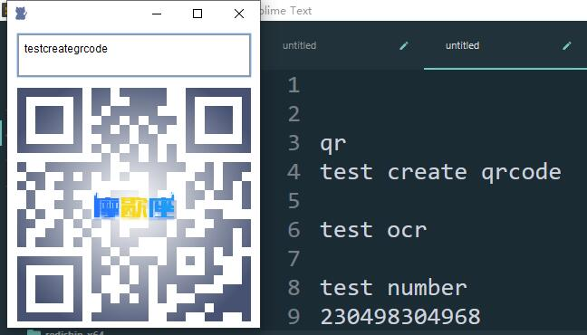
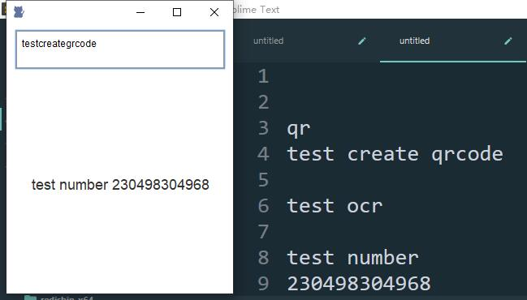

## OcrExe
- 使用开源的Tess4j实现简单的ocr文字识别

## 代码使用说明
> - 可直接启动MainFrame.main()  
> - 如果想打包成exe,可以使用/src/main/resources/ocr.exe4j配置打包(本人使用exe4j,可自行选择打包工具)  
> - 支持截图识别(支持全局快捷键,默认Ctrl+Alt+E)  
> - 支持启动参数选择外观主题    
>   目前支持以下几种参数:  
>   - mac: mac主题风格,使用quaqua.jar  
>   - metal: jdk自带  
>   - nimbus: jdk自带(推荐使用, 目前打包出来的默认启动参数就是这个)
>   - weblaf: 第三方主题包[weblaf](https://github.com/mgarin/weblaf)  
>   - beautyeye: 第三方主题包[beautyeye](https://github.com/JackJiang2011/beautyeye)

## 客户端使用说明
#### ps:尽量让区域背景纯色(干净点),文字大点,识别的成功率会高
> 支持窗口停靠屏幕边缘隐藏  
> 中键点击二维码区域窗口置顶  
> 按下快捷键进入截图画面(或者右键二维码区域),框选要识别的区域  
> 输入qr打头的框选可以生成相应的二维码,会自动复制到剪贴板(二维码内容会去除空格等开白字符),如下图
>   

> 框选要识别的区域,可识别区域的字母和数字(目前不支持中文),会自动复制到剪贴板如下图
> 
